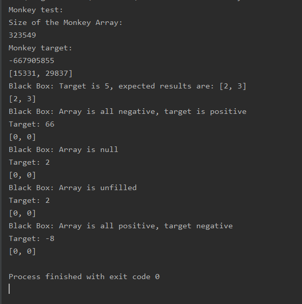
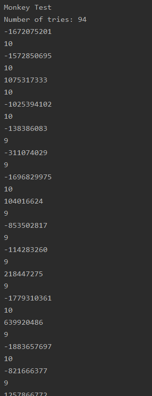
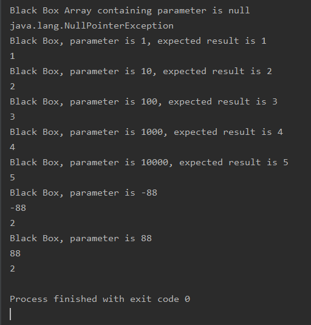

# Black Box/Monkey Tesztek Dokumentációja
## Tesztek tervezési fázisa
A tesztelésre kiválasztottam két matematikai algoritmust a gyűjteményben tároltak közül, ezek egyikére azért esett a választás, mert másik nyelvű implementációja már másik tesztcsoporttal vizsgálat alá lett vonva.
A kiválasztott tesztelési forma a Monkey Testing és a Black Box testing lett.

### Monkey Testing
Az eredetileg ide tervezett tesztek a Dumb Monkey kategóriába estek volna, viszont a tesztelt termék típusa (függvénykönyvtár, nem teljes alkalmazás) és az ebből következő felhasználási felület (IntelliJ IDE) ezt megakadályozták, hiszen az IDE kikényszerítette a függvények hívásakor a típushelyes paraméterek használatát. 
Ennek következtében a Monkey kénytelen volt Smart Monkey-vá fejlődni és véletlenszerű, de specifikáció szerint helyes adatokkal elárasztani a tesztelt függvényeket. 

### További Black Box tesztek
A Black Box tesztelés módszertanához híven a tesztek úgy készültek, mintha a függvény hívásakor futó kódot nem ismerném. Ennek egyenes következménye, hogy a tesztek ennek a kódnak a belső működését nem célozhatják meg. Maradt tehát az olyan szituációk szimulálása, amik előfordulhatnak éles használat közben.

Ebben az esetben is a körülmények (IDE, függvénykönyvtár, külső tesztelő alkalmazás/keretrendszer hiánya) kikényszerítették a típushelyes függvényhívásokat. Emiatt a tesztek nem vizsgálhatták azokat az eseteket, amikor a függvények paraméterei nem felelnek meg a specifikációknak. 

A tesztek között található olyan is, aminek a célja, hogy a függvények helyes, mindennapi használatakor elvárt visszatérési értékeit demonstrálják és olyanok is amiknek célja a függvény "eltörése".

## A tesztek futtatása, kiértékelése
### TwoSum tesztek

- A Monkey teszt eredménye érdekes, összeadva a két számot amit a függvény visszaadott, látjuk, hogy nem hozzák ki a célként megadott számot. Mivel a kód belső működésébe nem látunk bele, így a hiba okát sem tudjuk, viszont a nagy számok esete ezután mindenképpen további tesztelést érdemel.
- A tesztek eredményéből megtudjuk továbbá azt is, hogy a függvény látszólag hibatűrő, hiszen több, a tönkretételére célzott esetben is visszaad értéket, még ha alapvetően hibásat is, nem pedig elszáll kezeletlen hibaüzenettel. Erre viszont érdemes figyelnünk használatkor, hiszen jelzés nélkül okozhat szemantikai hibát. 
### CountDigits tesztek

- A Monkey teszt kiértékelése ebben az esetben kézzel szinte lehetetlen ennyi output mellett. Szúrópróba szerűen az értékek helyesek, de nincs kizárva, hogy valamelyik hibás legyen. A manuális tesztelés egyik hátránya. 
- A többi teszt eredménye alapján a függvény elvárásoknak megfelelően működik
