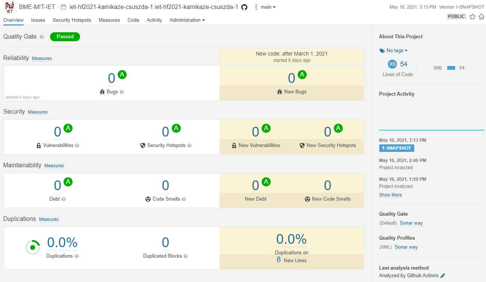

# **Statikus Analízis**

## **Statikus analízis SonarCloud-al**

A statikus analízist először a SonarCloud segítségével próbáltam végrehajtani. 

Ehhez szükség volt egy _pom.xml_ és egy _maven.yml_ fájl létrehozására a repositoryban. Ezen fájlok létrehozásával beüzemeltem a Maven build keretrendszert és a Github Actions workflow-t. Ezekre is szükség volt a SonarCloud általi statikus analízishez.

Eleinte problémákba ütköztem, mert nem sikerült buildelni a _maven.yml_ fájlt. Egy idő után rájöttem, hogy azért, mert nem ismerte fel a _pom.xml_ fájlt. Először azt gondoltam, hogy biztosan rosszul adtam meg a _pom.xml_-ben a groupId-t és az artifactId-t. Végül kideült, hogy nem ezzel volt a probléma, hanem a _mave.yml_ fájlban meg kellett adni a _pom.xml_ pontos elérési útvonalát.

Azonban a SonarCloud még mindig nem analizálta a teljes projektet. Egyedül a _pom.xml_ fájl-t, amiben nem talált semmilyen hibát. Az alábbi kép jobb oldalán látszódik, hogy csak 54 kód sort vizsgál meg.

Nagyon sokáig kutattam az interneten és többször is próbáltam frissíteni a két szükséges fájlt, de sajnos nem sikerült rájönnöm, hogy miért nem analizálja a többi fájlt. 

Végül úgy tűnt, hogy a SonarCloud valamennyire mégis működik. A Pull Requestek után jött mindig egy komment a SonarCloud-tól. Pedig, ha a SonarCloud oldalán nyitom meg a projektünket, akkor ott nem látszódott, hogy a _pom.xml_ fájlt leszámítva mást is nézne az oldal.

## **Statikus analízis SonarLint-el**

A SonarLint egy nagyszerű Extension a VS Code-hoz, mivel minden problémára, amit talál, ad egy learást arról, hogy ez miért probléma és ami a legfontosabb, hogy hogyan lehetne kijavítani. Véleményem szerint a CodeSmell-eket ilyen fajta segítség nélkül rendkívül nehéz észrevenni. Így ennek az eszköznek a segítségével sokat tud javulni a kód minősége.
A probléma ismertetése és javítási lehetőségei mellett azt is mutatja, hogy mennyire súlyos problémáról van szó.
A projekt bizonyos fájljain az alábbi Code Smell-eket javítottam a SonarLint magyarázatai és javaslatai alapján. Ezek a problémák fordultak elő a legtöbbször. Így több fájlban is kellett ilyen problémákat javítani.

A javított problémák között volt egy Bug is, mivel azt is tud keresni a SonarLint. Mivel nagyon nagy projektről van szó, így nem volt időm minden fájlt átnézni. Biztosan található benne több Bug is. Velem csak 1 fajta jött szembe, de az legalább 2 alkalommal. 

- Constant names should comply with a naming convention (java:S115) – Critical
- ”InterruptedException” should not be ignored (java:S2142) – Major – ez volt a Bug
- ”@Override” should be used on overriding and implementing methods (java:S1161) - Major
- Local variables should not shadow class fields (java:S1117) - Major
- Child class fields should not shadow parent class fields (java:S2387) - Blocker
- Methods of ”Random” that return floating point values should not be used in random integer generation (java:S2140) - Minor
- Modifiers should be declared in the correct order (java:S1124) - Minor
- Method names shloud comply with a naming convention (java:S100) - Minor
- Local variables should not be declared and then immediately returned or thrown (java:S1488) - Minor
- Local variable and method parameter names should comply with a naming convention (java:S117) - Minor
- Multiple variables should not be declared on the same line (java:S1659) - Minor

Mivel a SonarCloud nem működött az egész projektre, így nem tudom, hogy a CodeSmell-ek hány százalékát sikerült javítanom. Viszont abban biztos vagyok, hogy ezzel sokkal olvashatóbbá vált a kód és könnyebben lehet majd hibákat javítani a későbbiekben.