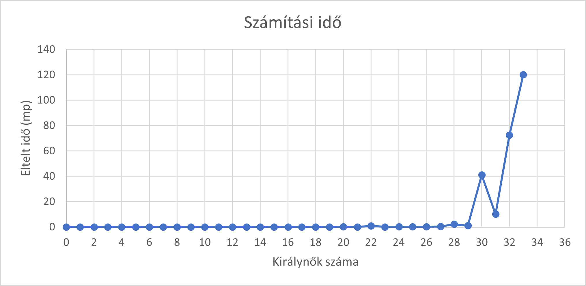
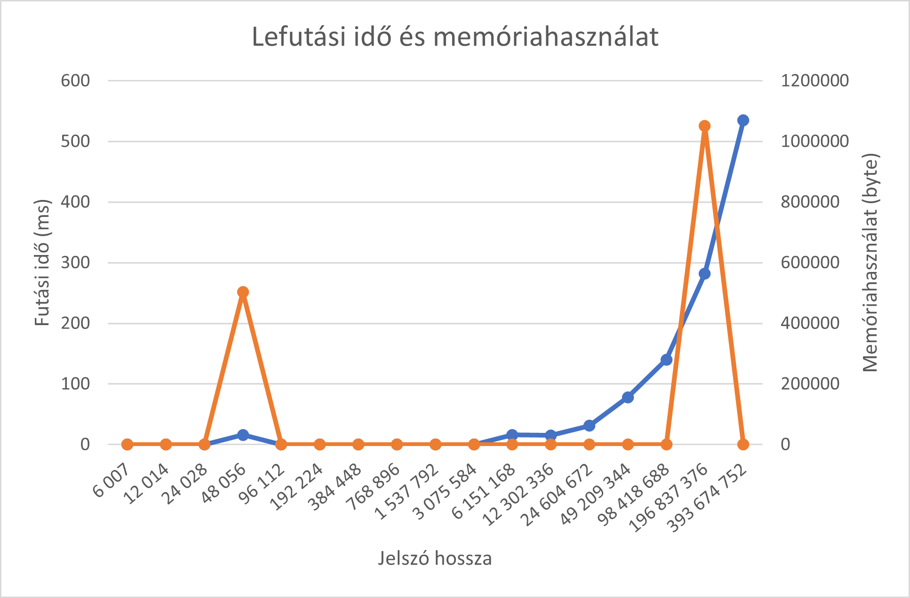

# Nem-funkcionális jellemzők vizsgálatának eredménye

## N-királynő probléma
### Használhatóság

A használhatóság ellenőrzésére a 8 királynő probléma megoldási lehetőségét vizsgáltam.
A probléma megoldásához felhasználtam a könyvtár által tartalmazott példakódot, ezt kisebb módosításokkal át lehetett alakítani úgy, hogy a számomra kívánt eredményt adja.
A teszt eredménye alapján megállaptottam, hogy jól felhasználható, és jó minőségű példa van a könyvtárban. Viszont adott bemenetre mindig csupán egyetlen megoldást ad.

### Felmerült problémák
A tesztelés során a következő problémákat találtam:

- Negatív szám esetén a program kezeletlen kivételt dob.

### Teljesítmény

Egy algoritmus teljesítményének mérésére a legjobb adat az algoritmus futásideje. A futásidő méréséhez a különböző bemeneti értékekre vizsgáltam az algoritmust. Az alábbi grafikon ábrázolja, hogy 29 fölött jelentősen nőtt az algoritmus lefutási ideje, 33 fölött pedig nagyságrendekkel megnőtt. Ez alapján megfigyelhető, hogy az algoritmus kis bemenetekre hatékony, vagyis gyakorlatban a teljesítmény jó.

## Prím faktorizáció
### Használhatóság

A használhatóság ellenőrzésére a faktorizációs problémák megoldását vizsgáltam.
A probléma megoldásához felhasználtam a könyvtár által tartalmazott példakódot, ezt kisebb módosításokkal át lehetett alakítani úgy, hogy a számomra kívánt eredményt adja.
A teszt eredménye alapján megállaptottam, hogy az algoritmus felhasználható.
Negatív számok esetén nem ír ki rossz eredményt, azonban félrevezethetően nem jelzi, hogy ilyen bemenetekre nem értelmezhető a művelet.

### Teljesítmény

Egy algoritmus teljesítményének mérésére a legjobb adat az algoritmus futásideje. A futásidő méréséhez a különböző bemeneti értékekre vizsgáltam az algoritmust. Az algoritmus minden értékre nagyon gyorsan lefutott, még nagyon nagy prímek szorzatára is. Mivel itt csak az eltelt időt vizsgáltam, a faktorizáció eredményét nem, kíváncsiságból ellenőriztem a korábbi használhatóság teszttel, hogy hogyan lehetséges, hogy kevesebb, mint 1 ms alatt lefut az algoritmus. Kiderült, hogy nagyon nagy számoknál az algoritmus már nem működik helyesen (két nagy prím szorzatára a bemeneti számot jelzi, vagy pedig rossz prímtényezőket sorol fel). A hibát azonban nem találtam meg benne az algoritmusban, a hibafeltételezhetően az integer nagyságának nem megfelelő kezeléséből adódott. Ez biztonsági problémákat is felvethet.

## Jelszó erősség vizsgáló
### Használhatóság

A használhatóság ellenőrzésére pár gyakori jelszót vizsgáltam.
A probléma megoldásához felhasználtam a könyvtár által tartalmazott példakódot, ezt kisebb módosításokkal át lehetett alakítani úgy, hogy a számomra kívánt eredményt adja.
A teszt eredménye alapján megállaptottam, hogy az algoritmus jól felhasználható.

### Teljesítmény

Egy algoritmus teljesítményének mérésére a legjobb adat az algoritmus futásideje. A futásidő méréséhez a különböző hosszúságú bemeneti értékekre vizsgáltam az algoritmust. Az algoritmus minden értékre nagyon gyorsan lefutott. Látványos növekedés csupán irreálisan nagy bemenetek esetén figyelhető meg. Vagyis az algoritmus a gyakorlatban nagyon hatékony.

